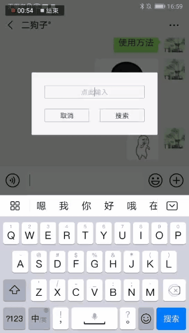

### 微信斗图最快最便捷的方式，没有之一(非 root 时)

### 实现方式
* 本 App 本质是一个输入法，但不支持输入任何正常的文字。
* 微信有一个隐藏功能，在微信的聊天输入框输入一个图片路径，如: "/storage/emulated/0/Android/data/com.qiao.gifin/cache/a.gif"，微信会自动读取该图片并发送，所以本输入法输入的都是类似的图片路径，以此来达到快速斗图的目的，图片表情通过内置的搜索来获得，并缓存到 App 目录。

### 表情来源
* 表情皆来自互联网：
    1. 斗图啦 https://www.doutula.com
    2. 斗图终结者 https://www.52doutu.cn (偶尔会抽风)
    3. 逗比拯救世界 http://www.bee-ji.com
* 本 App 不对搜索结果负任何责任哟。

### 使用方法
#### 初级使用(启用 Gifin 输入法，可不启用辅助功能)
* 方法一: 激活并启用 Gifin 输入法---->点击搜索表情---->弹出框切换回 Gifin---->点击输入框选择表情发送 (太复杂？别急)

    

* 方法二: 微信输入框输入想要搜索的表情关键字---->下拉通知栏切换为 Gifin 输入法---->选择表情发送 (还是有点复杂？试试高级用法)

    

#### 高级用法(开启辅助功能)
* 方法一: 同初级方法一，无需手动点击切换回 Gifin，无需再次点击微信输入框，辅助功能自动点击

    

* 方法二: 最便捷，同初级方法二，但无需下拉通知栏，长按自己的微信头像，自动搜索并展示

    

### 使用技巧
 * 短按设置隐藏历史，长按设置进入设置页面
 * 长按关闭会打开输入法选择器
 * 长按表情可收藏，点击收藏按钮展示，发送过的表情自动收藏，可在设置中修改
 * 卸载应用完全无残留，会清空所有的搜索历史、收藏、图片缓存，卸载前可备份
 * 搜索到的表情大多是动图，非常消耗流量，使用移动数据的望谨慎

### 一些坑
* 辅助功能经常被系统杀掉，哪怕加入后台清理白名单，加入电池优化忽略，也会被杀掉，国产机，放弃了，用初级方法二了
* 为什么代码文件夹使用搜狗输入法的结构，经测试，如果包名或者文件夹结构不是搜狗输入法的包名，动态表情会被转成一张普通图片发送，猜测搜狗输入法在微信白名单内
* 辅助功能自动点击可能会不准确，目前 Mate20Pro 亲测无误

### 权限声明
* 只需要读写外部储存的权限，用于备份恢复收藏夹和搜索历史，不需要可以拒绝。
* 开启辅助功能可获得最佳体验哟。
